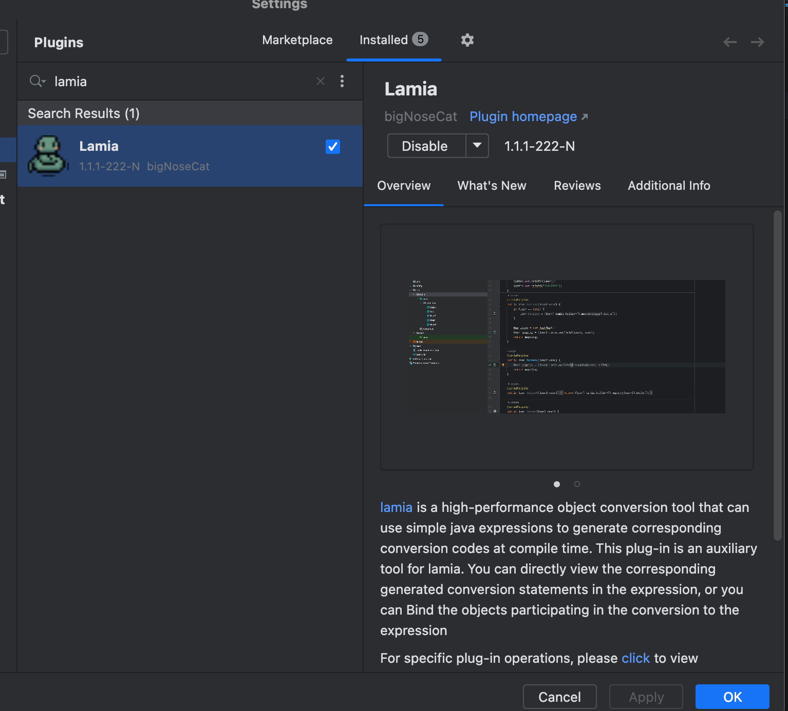
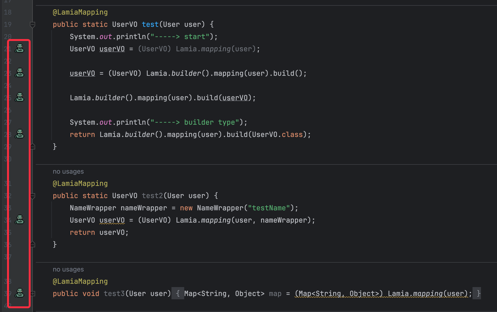
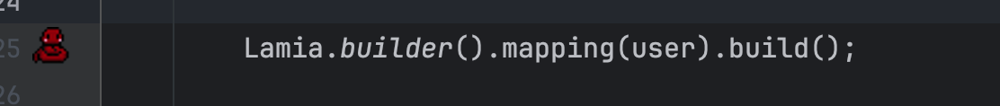
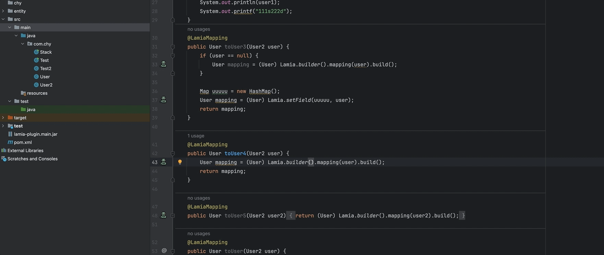
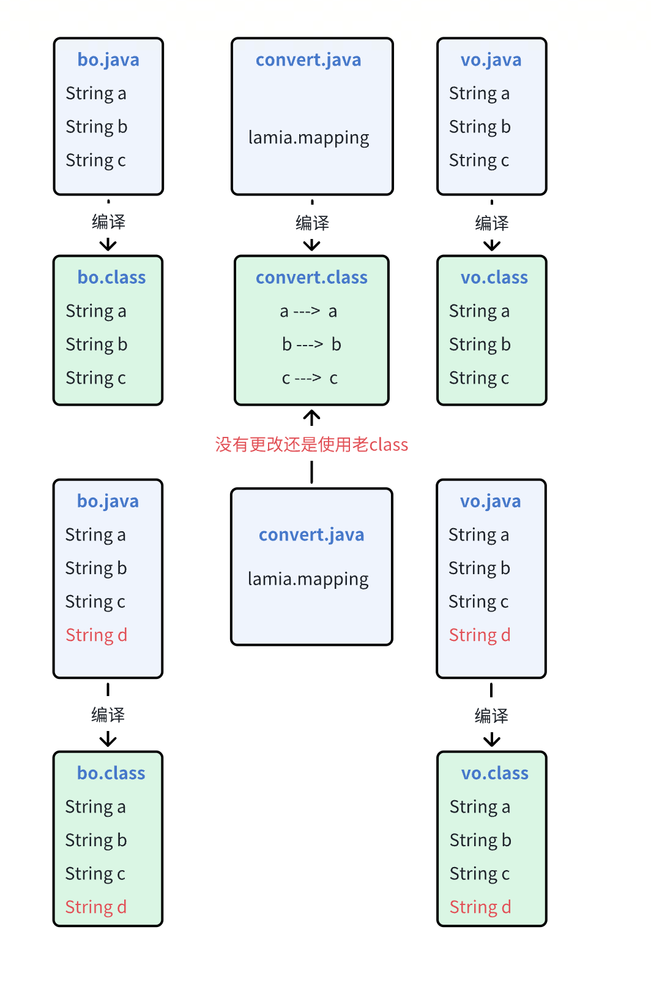
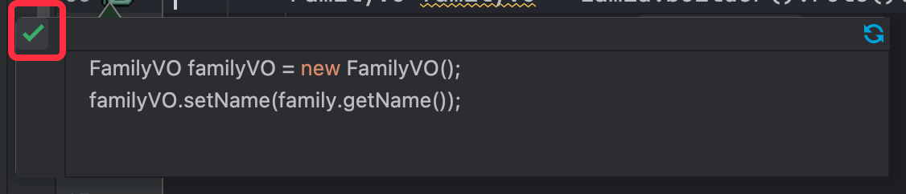
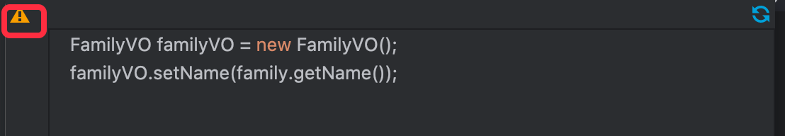
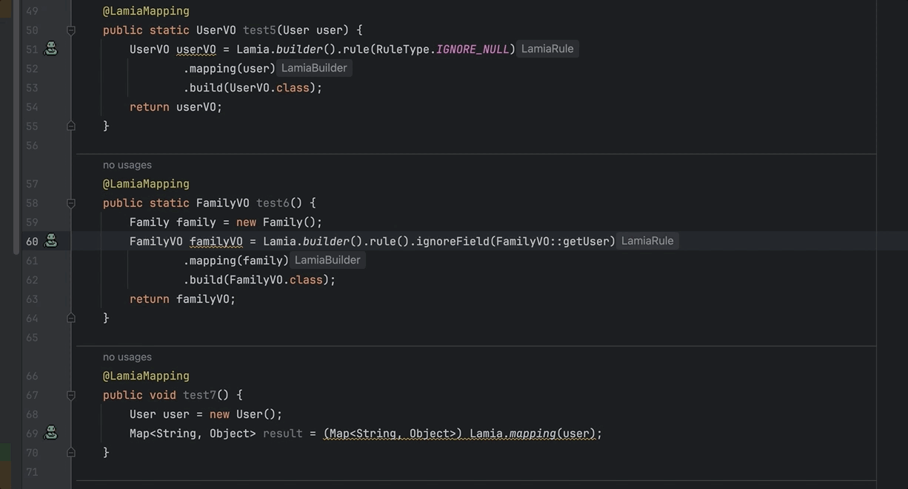
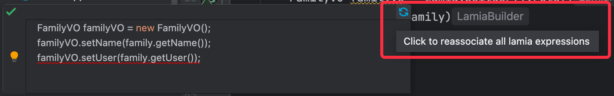

# 1. 简介

> 如果图片加载被墙可以访问 [lamia-plugin-gitee](https://gitee.com/bigNoseCat/lamia-plugin) 

本项目是一个 `idea-plugin` , 这个插件是用来辅助框架 [lamia](https://github.com/cao2068959/lamia) ，可以帮助
使用者更安全、便捷的使用lamia

- `lamia` 是致力于帮助java开发者 高性能、便捷的进行对象转换，具体可参考:  https://github.com/cao2068959/lamia

可以在`idea` plugin 商店中搜索`Lamia` 进行插件安装

本插件主要有以下能力:
- 可视化lamia生成的转换语句
- 对转换错误进行提示，并可生成对应的对策语句
- 支持增量编译
- 可以根据实体的字段跳转到对象转换表达式的地方

# 2. 可视化能力

安装插件之后，在项目中写完对应`lamia` 表达式之后，可以在左侧看到对应的`lamia`图标

> 如果写完表达式之后没有看到对应的图标，请检查你的@LamiaMapping 注解是否正确加上了

如果你表达式错误，比如缺少了目标类型设置，那么图标会显示红色

点击图标即可查看对应语句在编译时将会生成的转换语句

# 3 对转换错误进行提示，并可生成对应的对策语句

Lamia 是使用 名称进行匹配的，所以可能会出现名称相同但是类型不同的时候，这时候插件可以进行提示，并且帮你生成正确的语句
点击左侧的`灯泡`可以进行一些策略性的调整，会有如下选择
- `Ignoring fields`：修改转换语句，忽略类型不正确的字段
- `Ignoring fields and generate expression`: 修改转换语句，忽略类型不正确的字段，并且生成不匹配类型的转换语句

# 4. 支持增量编译
因为`lamia`是在编译期生成对应的表达式，需要编译到`lamia表达式`所在的文件，才会去生成对应的转换语句，而我们的`idea`在运行的时候可能是
增量编译的，首次全量编译之后，再次运行只会去编译你发生修改过的java类，这会导致lamia没有根据最新的对象进行生成转换语句如:

而`lamia-plugin` 则将解决上述问题，在增量编译`bo.java`/`vo.java` 的时候会去寻找到这个两个`java文件`和`convert.java`有关联，从而让
`convert.java` 也进行编译

当用户在写手`lamia`表达式的时候插件将会去解析整个表达式，建立了一个`表达式所在类(convert.java)` 和 `参与转换类(bo.java/vo.java)` 之间的一个索引数据

为了性能考虑，这里并不是实时去建立这个`索引`数据的，通过异步的方式去延迟构建这个索引信息，可能会有 `5~10s`左右的延迟，点击`lamia`图标可以查看
当前这个表达式的索引是否已经建立
- 索引已建立

- 索引未建立

如果常时间未建立索引、希望马上索引能够生效可以点击 `感叹号图标` 来马上建立索引

点击这个图标只会给`当前`点击的表达式建立索引，如果索引`大规模`失效可以点击转换框`右上角`的更新按钮来重新建立你`整个项目`的lamia索引

# 5. 根据实体的字段跳转到lamia表达式的位置

使用传统的自动转换对象工具有个最大的问题是，你无法知道你对象中的字段使用到了哪里，就算这个字段参与了对象转换idea也无法帮助你定位到转换的位置，会导致你在删除字段的时候有了一定的心智负担
尤其是反射类转换工具这个问题尤其明显，比如 `beanUtils`

lamia插件就解决了这个问题，如下:

__注意__: 这个能力也来自于上面 `4. 支持增量编译` 小节讲到的 `索引`数据，所以当索引还没建立好的时候是不能关联跳转的，可以点击同步按钮来重新建立索引，具体
可以参考 `4. 支持增量编译` 小节